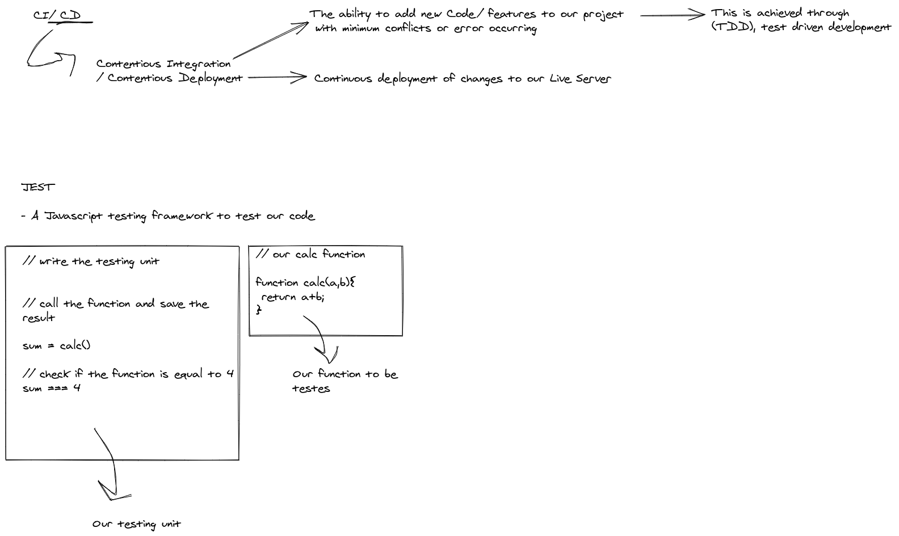

# server-deployment-practice1

### Links for the labs 

> [ci/cd GitHub Actions](https://github.com/MohammadAljadayh/server-deployment-practice1/actions)

>  [Repo link Main](https://github.com/MohammadAljadayh/server-deployment-practice1/tree/main)
>[Repo link dev](https://github.com/MohammadAljadayh/server-deployment-practice1/tree/dev)

>  [PR link](https://github.com/MohammadAljadayh/server-deployment-practice1/pull/1)

>  [Dev Branch Deployed heroku](https://mohammad-server-deploy-dev.herokuapp.com/)

>  [main Deployed heroku](https://mohammad-server-deploy-prod.herokuapp.com/)

### Setup

-  `.env` requirements
- `express` requirements
- `jest` requirements 
- `supertest` requirements  

### How to initialize/run your application ? 

- `nodemon`

### Tests

- How do you run tests?
   `npm test`

### Note

